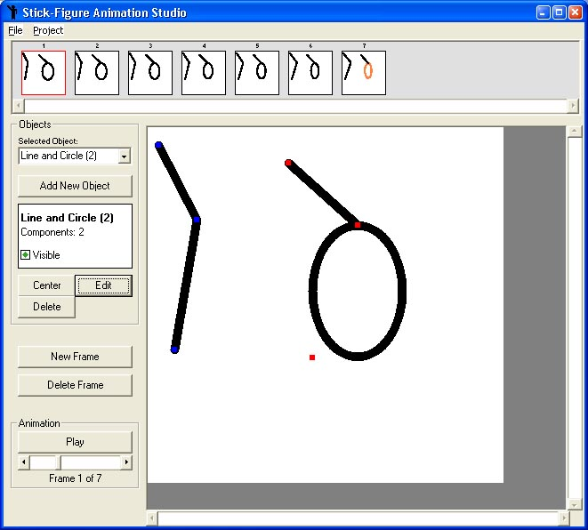



## Stickman Animation Studio \(Unfinished\)

### Description

A program that was *supposed* to be a replica of the popular "stickman" animation program called Pivot (freeware) but open source. I lost interest in this mid-way as it led into my "Photoshop-Like Layers Demo" project, but I present it here for those who want to hack it apart or even (snort) finish it. I admit the code is not one of my best efforts, as it is unfinished, uncommented and probably has many bugs but it may be of some use to someone. uses a mix of VB elements and GDI. No votes nessesary.
 
### More Info
 

             |
---                |---
**Submitted On**   |2005-05-27 22:22:14
**By**             |[Dean Camera](https://github.com/Planet-Source-Code/PSCIndex/blob/master/ByAuthor/dean-camera.md)
**Level**          |Intermediate
**User Rating**    |5.0 (10 globes from 2 users)
**Compatibility**  |VB 6\.0
**Category**       |[Complete Applications](https://github.com/Planet-Source-Code/PSCIndex/blob/master/ByCategory/complete-applications__1-27.md)
**World**          |[Visual Basic](https://github.com/Planet-Source-Code/PSCIndex/blob/master/ByWorld/visual-basic.md)
**Archive File**   |[Stickman\_A189558612005\.zip](https://github.com/Planet-Source-Code/dean-camera-stickman-animation-studio-unfinished__1-60850/archive/master.zip)

